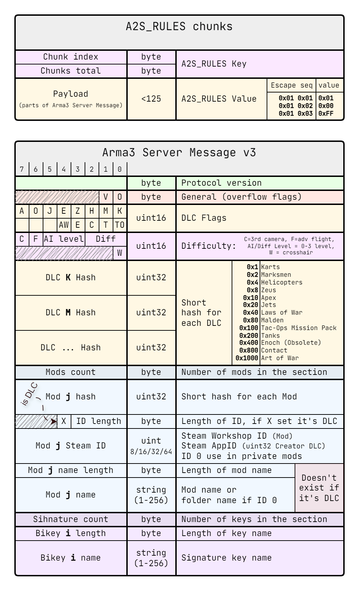
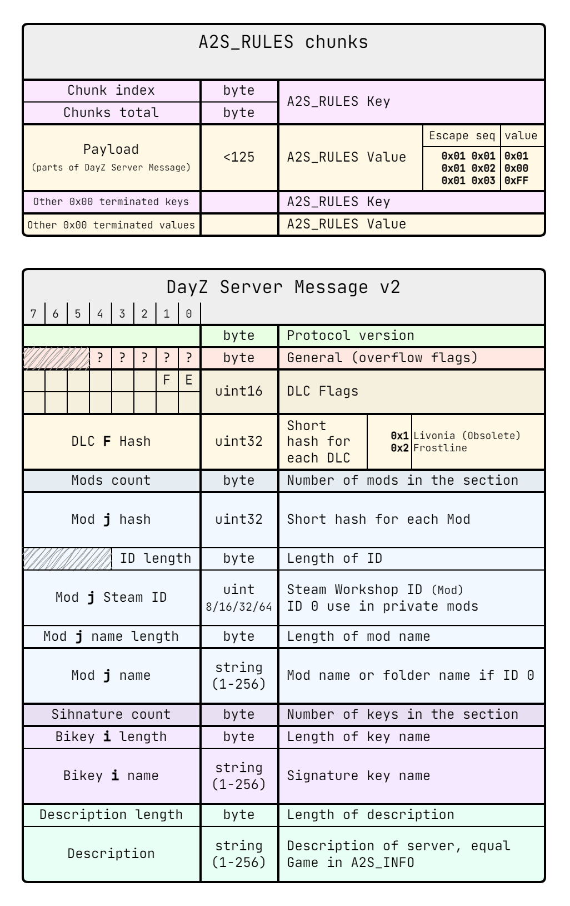

# Протоколы Arma3 Server Browser v3 и DayZ Server Browser v2

Оба протокола предназначены для передачи информации о сервере и обладают
схожей структурой, отличаясь лишь незначительными деталями. Они реализованы
как вложенные подпротоколы в рамках `A2S_RULES` протокола Steam. Ключи
передают данные о чанках (текущий индекс и общее количество), а значения
содержат сами чанки.

Сообщения с деталями о сервере формируются в соответствии с описанным
форматом и передаются через `A2S_RULES`. Перед отправкой сообщение
обрабатывается следующим образом:

1. **Экранирование**: Все байты, неподходящие для передачи через серверы
   Steam, заменяются согласно таблице:
   * `{0x01, 0x01}` → `0x01`
   * `{0x01, 0x02}` → `0x00`
   * `{0x01, 0x03}` → `0xFF`
2. **Разделение на части**: Сообщение делится на фрагменты длиной `124`
   байта и помещается в ключ-значение `A2S_RULES`.

Если общее сообщение превышает `1400` байт (максимальный размер одного
UDP-пакета в Steam API), часть информации необходимо сокращать. Однако на
практике зачастую используется буфер размером до `8192` байт, что позволяет
серверам отправлять все данные в одном пакете.

Исходная информация:
<https://community.bistudio.com/wiki/Arma_3:_ServerBrowserProtocol3>

## Протокол Arma3 Server Browser v3

## Протокол DayZ Server Browser v2

