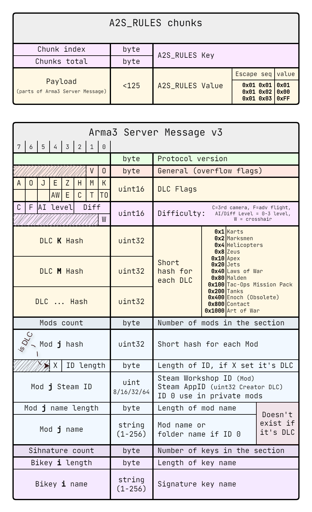
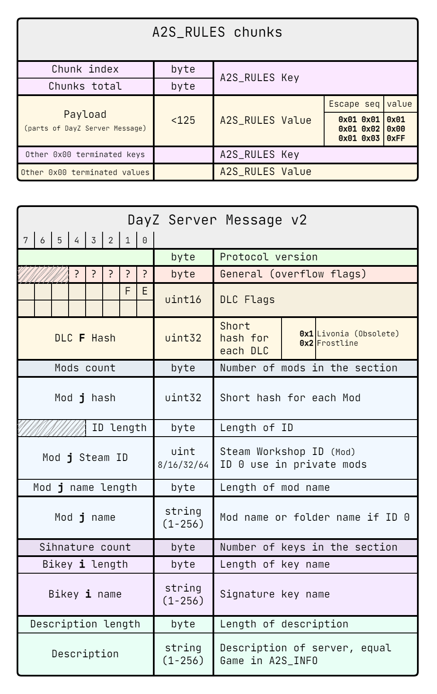

# Протоколы Arma3 Server Browser v3 и DayZ Server Browser v2

Оба протокола предназначены для передачи информации о сервере
и обладают схожей структурой, отличаясь лишь незначительными деталями.
Они реализованы как вложенные подпротоколы в рамках `A2S_RULES` протокола Steam.
Ключи передают данные о чанках (текущий индекс и общее количество),
а значения содержат сами чанки.

Сообщения с деталями о сервере формируются
в соответствии с описанным форматом и передаются через `A2S_RULES`.

При декодировании парсер заменяет escape-пары на исходные байты:

* `{0x01, 0x01}` → `0x01`
* `{0x01, 0x02}` → `0x00`
* `{0x01, 0x03}` → `0xFF`

При кодировании [AppendEscapeSequences] выполняет обратное преобразование:

* `0x01` → `{0x01, 0x01}`
* `0x00` → `{0x01, 0x02}`
* `0xFF` → `{0x01, 0x03}`

На следующем этапе paging экранированное сообщение делится на фрагменты
и помещается в ключи-значения `A2S_RULES`.

Если общее сообщение превышает `1400` байт
(максимальный размер одного UDP-пакета в Steam API),
часть информации необходимо сокращать.
Однако на практике зачастую используется буфер размером до `8192` байт,
что позволяет серверам отправлять все данные в одном пакете.

Исходная информация:
<https://community.bistudio.com/wiki/Arma_3:_ServerBrowserProtocol3>

## Протокол Arma3 Server Browser v3

## Протокол DayZ Server Browser v2

[AppendEscapeSequences]: https://pkg.go.dev/github.com/WoozyMasta/a2s/pkg/a3sb#AppendEscapeSequences
